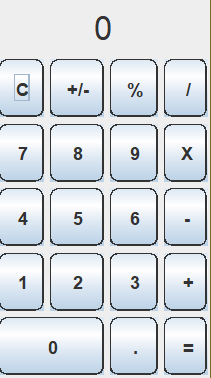

# Java Calculator

This project is the GUI and processing for a simple four function calculator. This project was created as a personal test of my own skills in Java after spending a semester learning it in class. I purposefully avoided looking at already existing code for calculators in Java to try and come up with as much as I could on my own. I still ended up using online resources to help with the GUI.

## Technologies

-   Java 11.0.12
-   Java Swing

## Running

To run the calculator, first compile GUI.java with
`javac GUI.java`.
Then run the file with
`java GUI`.
The following GUI should appear and the calculator can be used.\
\
\

## Features

-   Can perform simple addition, subtraction, multiplication, and division
-   The ability to use decimals and perform operations with them
-   Percentage symbol divides the number by 100
-   +/- symbol negates the number, allowing for operations with negative numbers
-   Most inputs form the numpad are also accepted, with Enter being the equals sign

## Future Plans

I may add on to this project in the future with more features. I would like to try and add more of the featuers found on traditional scientific calculators such as trigonmetric functions and scientific notation. I would also like to work on a better looking GUI and have an option to flip between the four function and scientific versions of the calculator. Adding functionality to the calculator is relatively easy, as I can mostly use built in Java functions to perform operations.

## Sources

I used the following resources to help me figure out how to do different GUI things.

-   Resize the font of a label to take maximum size - <https://stackoverflow.com/questions/2715118/how-to-change-the-size-of-the-font-of-a-jlabel-to-take-the-maximum-size>
-   Java Documentation on GridBagLayout - <https://docs.oracle.com/javase/tutorial/uiswing/layout/gridbag.html>
-   Rounded Borders - <https://stackoverflow.com/questions/423950/rounded-swing-jbutton-using-java>
